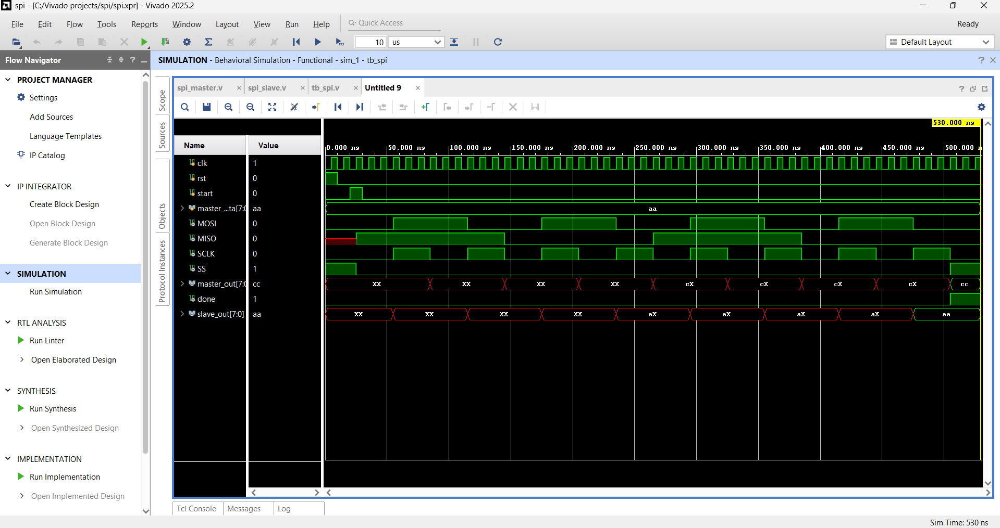
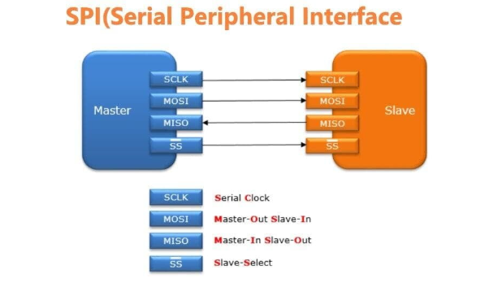

# SPI Communication Protocol (Verilog)

## Overview:
This project implements the SPI (Serial Peripheral Interface) communication protocol using Verilog HDL in AMD Vivado. It demonstrates data transfer between a master and slave device using synchronous serial communication.

## Objective:
* Understand SPI communication protocol
* Implement master-slave data transfer
* Design synchronous serial communication system

## Working Principle:
SPI is a synchronous full-duplex communication protocol.
It uses four main signals:
* **SCLK (Serial Clock)** → Generated by master
* **MOSI (Master Out Slave In)** → Data from master to slave
* **MISO (Master In Slave Out)** → Data from slave to master
* **SS (Slave Select)** → Enables slave device

### Data Flow:
* Master initiates communication
* Clock synchronizes data transfer
* Data is shifted bit-by-bit on clock edges
* Transmission happens simultaneously in both directions

---

## Tools Used:

* Verilog HDL
* AMD Vivado (Simulation)

---

##  Project Structure:

* `src/` → SPI master and slave design files
* `tb/` → Testbench
* `simulation/` → Waveform outputs
* `docs/` → Design diagrams

---

##  How to Run (Vivado):

1. Open AMD Vivado
2. Create a new project
3. Add design files from `src/`
4. Add testbench from `tb/`
5. Run simulation

### Observe in Waveform:

* SCLK generation
* MOSI data transmission
* MISO data reception
* Slave select (SS) behavior
* Bit-by-bit shifting of data

---

##  Results

### SPI Communication Waveform

### SPI Block Diagram

---

## 🔮 Future Improvements

* Implement SPI modes (Mode 0,1,2,3)
* Add timing analysis
* Support multiple slave devices
* Integrate with FPGA hardware

---

## 👨‍💻 Author
## Ananth R M
